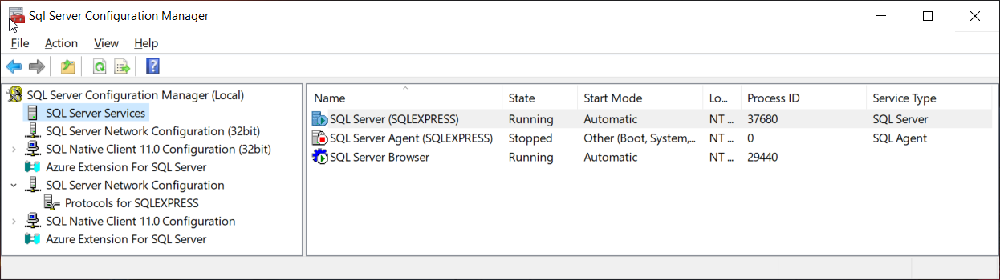

# Microsoft SQL Server Express

> _Image 1: MS SQL Server Manager sample_

---

## Overview

Microsoft SQL Server Express is a lightweight, free edition of Microsoft SQL Server designed for small-scale applications, development, and learning purposes.

It provides a reliable relational database engine with many of the features of the full SQL Server editions, making it ideal for local development and testing environments.

---

## Key Features
-   Lightweight and free edition for local and small-scale use;
-   Supports core relational database engine features (tables, indexes, stored procedures);
-   Backup and restore capabilities for development data;
-   Compatible with most SQL Server tools and libraries.

---

## Usage in My Workflow
I use SQL Server Express to:  
-   Create local development databases without affecting production servers;
-   Test SQL queries and stored procedures in a safe environment;
-   Prototype small applications and proof-of-concept systems.

---

## Tips & Tricks
-   Enable **SQL Server Browser** service to allow network connections during development;
-   Use **SSMS** for advanced query editing, execution plans, and database monitoring;
-   Set up **automatic backups** of your local databases to avoid losing test data; 

---

## Official Resources
-   [Official Website](https://www.microsoft.com/en-us/sql-server/sql-server-downloads)  
-   [Documentation](https://docs.microsoft.com/en-us/sql/sql-server/?view=sql-server-ver16)  
